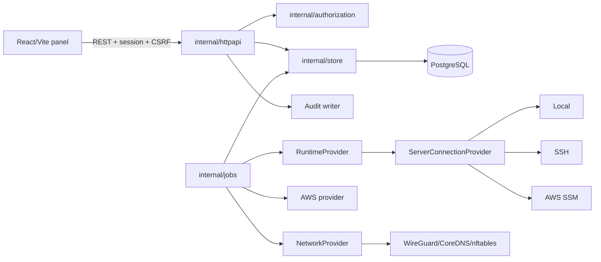

# Architecture

Silicon is a modular monolith: one Go process owns HTTP delivery, authorization, orchestration, provider composition, asynchronous workers, and PostgreSQL persistence. React consumes a versioned REST API. Independent processes exist only for a justified privilege boundary, such as the host-side updater.

`backend/cmd/silicon/main.go` is the composition boundary. It loads configuration, opens pgx, runs migrations, constructs concrete adapters, and starts deployment, AWS, and network runners plus the HTTP server.

Business code depends on contracts in `backend/internal/providers/*`; concrete cloud/runtime implementation details remain in adapters. Provider selection belongs at composition/dispatch boundaries rather than scattered `if provider == ...` branches.

Organizations are tenant boundaries. Handlers authorize named permissions, repository queries include organization scope, and composite foreign keys reinforce same-tenant parent/child relationships. Safe audit events are written alongside meaningful changes.

See [Backend](backend.md), [Providers](providers.md), and [Networking internals](networking-internals.md).
