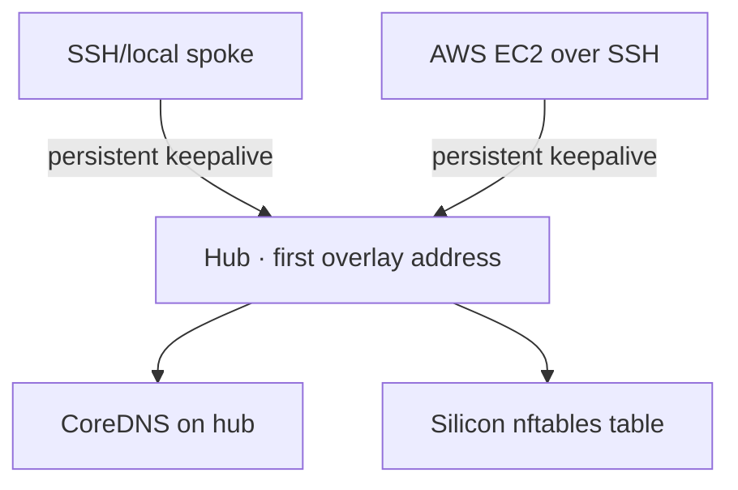

# Private networking internals

The schema in `000010_private_networking.up.sql` defines organization-owned networks, members, services, policies, operations, and queued reconciliation jobs. `internal/store/networks.go` validates private canonical CIDRs, serializes address allocation with PostgreSQL advisory locks, and preserves organization context.

`internal/jobs/network_runner.go` claims/retries work and takes a per-network advisory lock across replicas. It first ensures public host identities, then builds a normalized desired state and calls `internal/providers/network.Provider` for every member. The WireGuard adapter is in `internal/providers/network/wireguard`.

Private keys are generated and stored only on each host. Silicon stores public keys. CoreDNS on the hub serves `.internal` records. Docker binds attached services to member overlay addresses and injects the private DNS resolver/search domain.

Policy identifies a source application by the member overlay address. Same-project service traffic is allowed; cross-project traffic is denied unless an explicit same-organization application-to-service rule exists. The current model therefore permits one attached application per member and one Silicon Network per application.

Current limits: hub-and-spoke only, private IPv4 only, no NAT traversal, no direct-peer optimization, no HA hub, and no SSM-only configuration transport.
