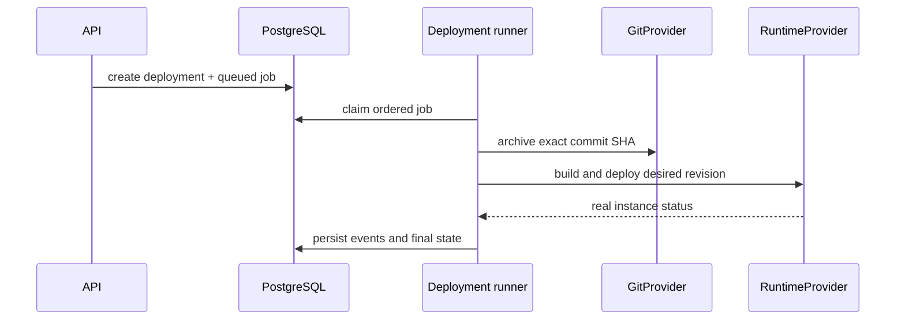

# Runtime and deployment pipeline

`internal/providers/runtime/runtime.go` defines build, deploy, lifecycle, inspect, status, and log operations. `dispatcher.go` selects the explicitly enabled local provider or the server provider. `runtime/server` resolves a typed connection executor, then reuses the Docker adapter instead of duplicating lifecycle behavior.

`internal/execution/DockerDeploymentExecutor` resolves effective variables/secrets and source material. GitHub sources are downloaded and built at the exact stored commit SHA. `internal/jobs/runner.go` claims PostgreSQL jobs and drives the deployment state machine.

An internal port is not a public binding. Explicit host bindings and active private-network bindings are passed as separate runtime inputs. Lifecycle actions verify Silicon ownership labels before touching a container.
